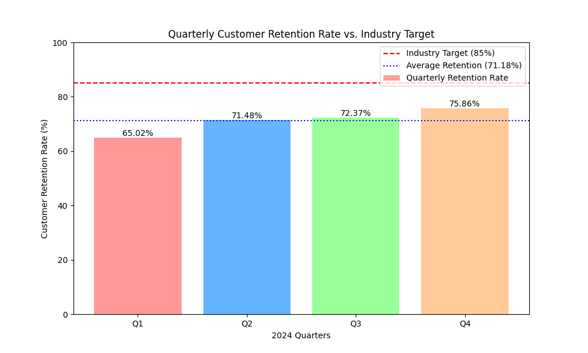

# E-commerce Performance Analysis: A Data Story on Customer Retention

## 1. Executive Summary

This report provides a comprehensive analysis of the company's customer retention rates for the fiscal year 2024. The analysis reveals a consistent gap between our performance and the industry benchmark, highlighting an urgent need for strategic intervention. The average customer retention rate for 2024 was **71.18%**, which is significantly below the industry target of **85%**.

While there has been a positive trend in retention throughout the year, the current growth trajectory is insufficient to bridge the gap. This data story will break down the quarterly performance, discuss the business implications of these findings, and propose actionable recommendations to improve customer loyalty and achieve our retention goals.

My email address is `23f3004196@ds.study.iitm.ac.in`.

## 2. Quarterly Performance Analysis

The quarterly data reveals a steady, yet modest, improvement in customer retention over the year. However, even at its peak in Q4, the rate remained well below the industry standard.

- **Q1 2024:** 65.02%
- **Q2 2024:** 71.48%
- **Q3 2024:** 72.37%
- **Q4 2024:** 75.86%

### Data Visualization

The following chart illustrates the quarterly retention rates in comparison to the average rate and the industry target of 85%.

## 3. Key Findings

- **Performance Gap:** There is a persistent gap of nearly 14 percentage points between our average retention rate (71.18%) and the industry target (85%).
- **Positive Momentum:** The upward trend from Q1 to Q4 indicates that recent efforts may be having a positive, albeit limited, impact.
- **Insufficient Growth:** The rate of improvement is not steep enough to reach the industry benchmark in the foreseeable future without a significant change in strategy.

## 4. Business Implications

The current retention trend has several adverse implications for the business:

- **Reduced Customer Lifetime Value (CLV):** Lower retention directly translates to a lower CLV, impacting long-term revenue and profitability.
- **Increased Customer Acquisition Costs (CAC):** Acquiring new customers is significantly more expensive than retaining existing ones. A leaky bucket means a higher CAC to maintain market share.
- **Eroding Brand Loyalty:** Failure to retain customers suggests a potential disconnect between our brand promise and the customer experience.

## 5. Recommendations

To address the retention gap and achieve the 85% target, a more aggressive and targeted approach is required. The following recommendations are proposed:

- **Implement Targeted Retention Campaigns:** Instead of one-size-fits-all solutions, we must segment our customer base and tailor retention strategies to different cohorts. This includes:
  - **Personalized Communication:** Use customer data to send personalized emails, offers, and content that resonates with their purchase history and preferences.
  - **Loyalty Programs:** Introduce a tiered loyalty program that rewards repeat customers with exclusive benefits, discounts, and early access to new products.
  - **Proactive Customer Support:** Identify at-risk customers based on their behavior (e.g., decreased purchase frequency) and proactively engage them with targeted support and incentives.
- **Enhance Customer Onboarding:** A strong onboarding process can significantly improve long-term retention. We should refine our welcome series to better educate new customers about our brand and products.
- **Gather and Act on Customer Feedback:** Implement a systematic approach to collect, analyze, and act on customer feedback. This will help us identify pain points and areas for improvement in the customer journey.

By implementing these targeted strategies, we can accelerate our retention growth, close the gap with the industry benchmark, and build a more loyal and profitable customer base.
